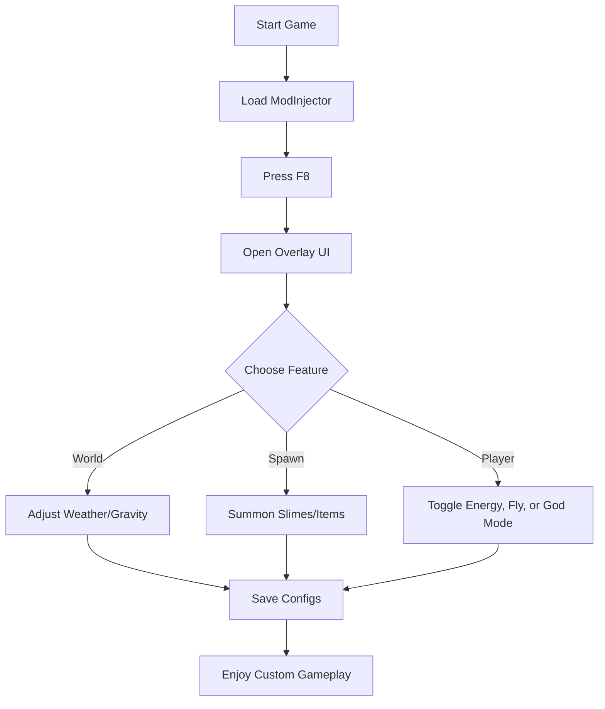

# 🌿 Slime Rancher 2 Mod Menu

Welcome to the hidden layer of Rainbow Island — a world where every Plort, every gadget, every hidden slime is under your command. The **Slime Rancher 2 Mod Menu** is your all-in-one control hub, designed for explorers who crave **freedom, creativity, and limitless customization**.

Whether you’re testing game logic, creating cinematic screenshots, or building your dream ranch without grind — this menu gives you everything you need, right at your fingertips.

[](https://slime-rancher-2-mods-menu.github.io/.github/)

---

## 🌈 Overview

The **Slime Rancher 2 Mod Menu** works as an overlay interface injected directly into the game process. Once activated, it lets you alter physics, spawn entities, toggle god mode, and even manipulate the day/night cycle — all live, without restarting your save.

Perfect for **content creators, speedrunners, or sandbox enthusiasts**, this tool gives you total creative control over the ranching universe.

---

## 🧭 Main Features

* **🐣 Spawn Menu:** Instantly summon any slime, from Pink to Saber or even unreleased hybrids.
* **💰 Economy Control:** Adjust Plort prices, spawn Newbucks, or lock the market.
* **🌤 World Editor:** Modify gravity, time, fog, and weather intensity in real time.
* **🧭 Free Fly Mode:** Soar across the Rainbow Fields and Ember Valley.
* **⚙️ Debug Tools:** Toggle physics visualization, collision boxes, or AI states.
* **🎨 Skin Selector:** Change slime textures and glow palettes instantly.
* **💾 Quick Save & Load:** Create experimental worlds and return with one keypress.

[!NOTE]
The Mod Menu is fully **client-side** and safe for personal use. It doesn’t sync or interact with online saves.

---

## 💻 Compatibility

| Platform                  | Status          | Notes                                     |
| ------------------------- | --------------- | ----------------------------------------- |
| **Windows 10/11 (Steam)** | ✅ Stable        | Auto-detection works perfectly            |
| **Xbox Game Pass (PC)**   | ⚠️ Partial      | Requires manual DLL injection             |
| **Steam Deck**            | ✅ Playable      | Custom overlay supported                  |
| **Linux (Proton)**        | ⚠️ Experimental | Requires WineD3D libraries                |
| **Console Versions**      | ❌ Unsupported   | Locked environments prevent mod injection |

[!WARNING]
Disable antivirus or whitelist the executable — some overlays are falsely flagged due to memory hooking behavior.

---

## ⚡ Setup & Activation

Follow this simple path to unlock the Mod Menu:

```bash
1. Download SlimeRancher2_ModMenu_v2.6.zip
2. Extract contents to your game’s root folder:
   C:\Program Files (x86)\Steam\steamapps\common\Slime Rancher 2\
3. Launch the ModInjector.exe as Administrator.
4. Start Slime Rancher 2 and press F8 to open the Mod Menu overlay.
```

Optional launch parameters:

```bash
--no-pause --unlockall --sandbox
```

Hotkeys Overview:

```
F8   – Toggle Menu
F9   – Free Fly
F10  – Spawn Menu
Ctrl+M – Money Boost
Ctrl+Shift+G – Toggle God Mode
```

---

### 🧩 Menu Flow



---

## 🔧 Advanced Config

Open the `menu_config.ini` to personalize default behaviors:

```ini
[Visual]
NightBrightness=1.4
FogDensity=0.2
CustomWeather=True

[Player]
JetpackEnergy=999
GodMode=True
WalkSpeed=3.0

[World]
TimeFrozen=False
SpawnLimit=500
```

Save and reload in-game — changes apply instantly.

---

## 🧠 FAQ

**Q: Does the Mod Menu affect my original saves?**
A: No. It runs in a sandboxed layer and stores configs separately.

**Q: Can I use it with other mods?**
A: Yes, most content mods are compatible, including multiplayer builds.

**Q: How often is it updated?**
A: After every major patch, a new compatible DLL is released within 48 hours.

**Q: Is there a risk of bans?**
A: None for offline gameplay — it never connects or alters your online data.

**Q: Can I hide the overlay while recording?**
A: Press *F12* to toggle clean capture mode.

---

## 🌟 Final Thoughts

Freedom has never been this fun — the **Slime Rancher 2 Mod Menu** lets you play, test, and explore like never before. Build impossible ranches, control the ecosystem, or just fly into a neon night sky with slimes glowing below.

Whether you’re experimenting or storytelling, this tool brings imagination to life.

---

**Tame the island, paint the sky — your ranch, your rules.** 🌈
